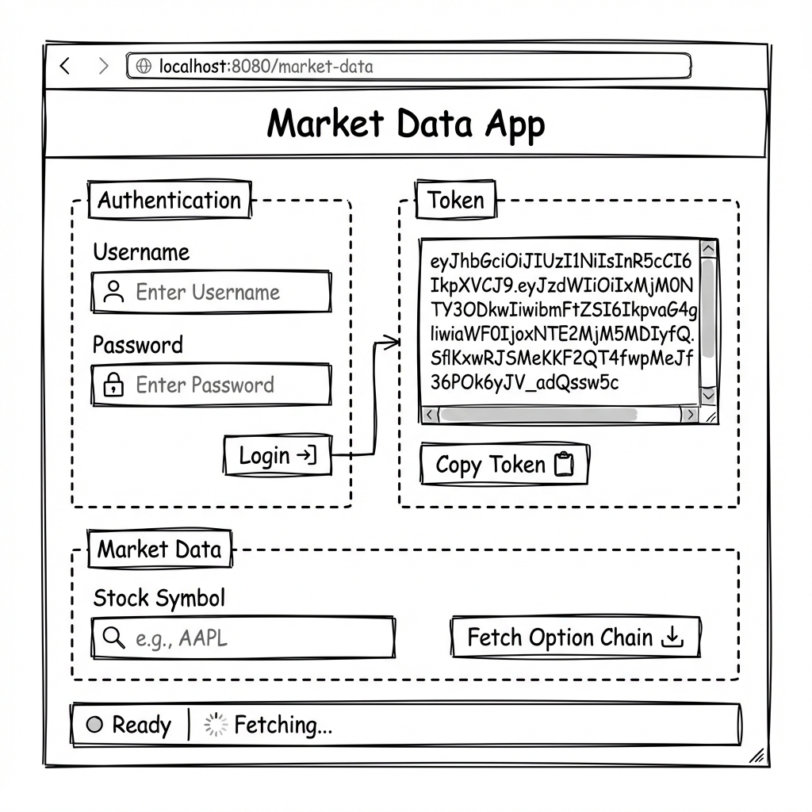

# Web Interface Proposal

Here is a proposed wireframe for the web-based version of the Market Data application.

## Technology Stack
To implement this, we could use:
- **Streamlit**: Very fast to build, pure Python, great for data apps.
- **Flask/Django**: More control, standard web frameworks.

## Features
- **Authentication**: Secure login form.
- **Token Management**: Display and copy token.
- **Data Fetching**: Input symbol and fetch data.
- **Status Updates**: Real-time feedback.
