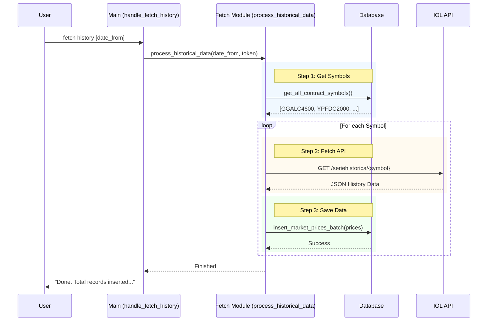

# Fetch Commands

This section details how the data fetching commands work, including the interaction between the CLI, the Controller, and the Database.

## Overview

The `fetch` command group deals with retrieving option chains, individual contracts, and historical price series from the Invertir Online (IOL) API.

## Fetch History Workflow

The `fetch history` command (`handle_fetch_history`) is the most complex operation, designed to backfill price data for all known contracts.

### Command Flow

1. **CLI Layer**: `main.py` receives the command.
2. **Controller**: `fetch_data.py` orchestrates the process.
3. **Database**: `database.py` provides the list of symbols and saves the results.

### Sequence Diagram

## Functions Involved

- [`src.main.handle_fetch_history`][src.main.handle_fetch_history]
- [`src.fetch_data.process_historical_data`][src.fetch_data.process_historical_data]
- [`src.database.get_all_contract_symbols`][src.database.get_all_contract_symbols]
- [`src.fetch_data.fetch_historical_prices`][src.fetch_data.fetch_historical_prices]
- [`src.database.insert_market_prices_batch`][src.database.insert_market_prices_batch]
