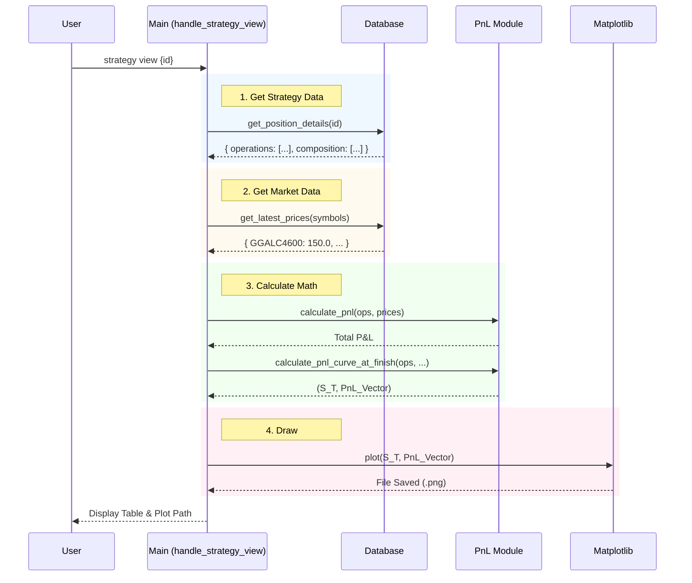

# Strategy Management

This section explains how strategies are managed, visualized, and analyzed.

## Viewing a Strategy

The `strategy view` command aggregates data from multiple sources to present a comprehensive snapshot of a trading strategy, including its composition, current P&L, and payoff profile at expiration.

### Command Flow

1. **Retrieve Details**: Fetches the strategy's operations and contract details from the database.
2. **Fetch Prices**: Gets the latest known prices for the relevant contracts.
3. **Calculate P&L**: Computes the current profit/loss and simulates the expiration curve.
4. **Visualize**: Generates a matplotlib plot.

### Sequence Diagram

## Functions Involved

- [`src.main.handle_strategy_view`][src.main.handle_strategy_view]
- [`src.database.get_position_details`][src.database.get_position_details]
- [`src.pnl.calculate_pnl`][src.pnl.calculate_pnl]
- [`src.pnl.calculate_pnl_curve_at_finish`][src.pnl.calculate_pnl_curve_at_finish]
